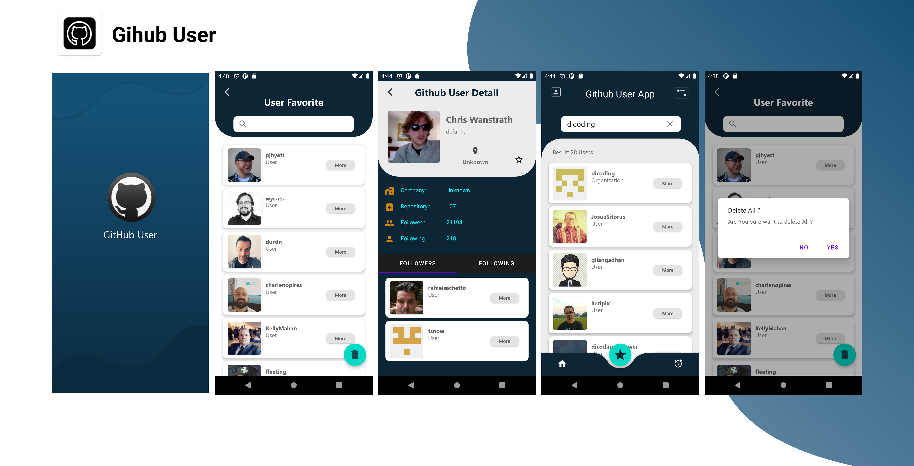

Dicoding Bangkit

# Github User App
Android Github User build with MVVM Architechtures, Room, Coroutines

### App Features
* **User** - menampilkan daftar user github
* **User Favorite** - menampilkan daftar user yang sudah ditambahkan sebagai favorite
* **Search User** - untuk melakukan pencarian User
* **Follower User** - untuk menampilkan follower dari detail user
* **Following User** - untuk menampilkan following dari detail User

* **Search User Favorite** - untuk melakukan pencarian User Favorite


### Screenshot
<span align="center">
 <hr>
 <p align="center"></p>
 <p align="center">Screenshot</p>
 <hr>
 </span>

### API
Api yang digunakan dalam project ini yaitu https://api.github.com

Base URL yang digunakan adalah sebagai berikut
```
https://api.github.com/
```

#### Endoint Used

|Method | Endpoint | Usage |
| ---- | ---- | --------------- |
|GET| `/users` | All Users|
|GET| `/search/users` | Search users.| 
|GET| `/users/{username}` | Get Detail User.| 
|GET| `/users/{username}/followers` | Get Followers Detail User .|
|GET| `/users/{username}/following` | Get Following Detail User .| 
